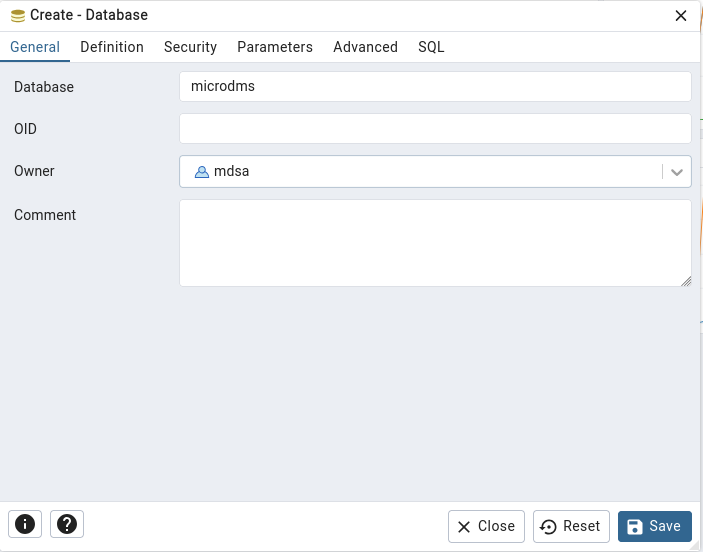

# MicroDMS Service

## Releases
### 2025-01-31 1.0.0
- First version with basic functionality

### 2025-02-06 1.1.0
- File encryption/decryption 

## Deploying the MicroDMS Service

MicroDMS provides a flexible and scalable deployment model, which covers the full range of possible usages from home-lab to multinational organizations.

The MicroDMS images are provided via dockerhub, but for the deployment scenarios certain customization might be necessary. In this project there are examples for
- building a customized MicroDMS image
- using this customized image in various environments

## Home-lab Deployment


This is the simplest way of using the DMS software, recommended for trial or internal testing. The frontend app is embedded into the backend and will be served by the embedded Tomcat server. This deployment may provide good performance for 10-20 users. 

You need only one single docker container or the standalone version for Windows. 

Even in this case the backend supports HTTPS communication.

docker-compose: [docker-compose.yml](./docker-compose/my-microdms/docker-compose.yml).

Starting up the containers:
```
docker-compose up -d
```

## Small Business Deployment


In this scenario the frontend is deployed separately on Nginx, which proxies the requests to the backend container. We can use the additional security of Nginx, therefore this is the recommended option for publishing the service on the internet. It may perform well for 50-100 users.

TLS will be terminated by Nginx.

docker-compose: [sb.yml](./docker-compose/my-microdms/sb.yml).

Starting up the containers:
```
docker-compose -f sb.yml up -d
```

A working example: https://demo.microdms.com 

## Scalable Deployment


This deployment is recommended for use in **Kubernetes** or **Openshift**, if the organization has many hundred users. The very same images can be used for building the pods. It provides **horizontal scalability** both on backend and frontend side. Only the hardware resources can limit the maximal user count.

More details coming soon.

## Building a customized MicroDMS image
Please see `./docker-build/build-docker-image.sh`.

## Starting the application

After the container started up, the database have to be created. Please follow these steps.

Use the pgadmin in http://localhost:5410. You can log in with user@example.com/sa.

### 1. Register the server


### 2. Create a login


### 3. Create the database



### 4. Create the schema


